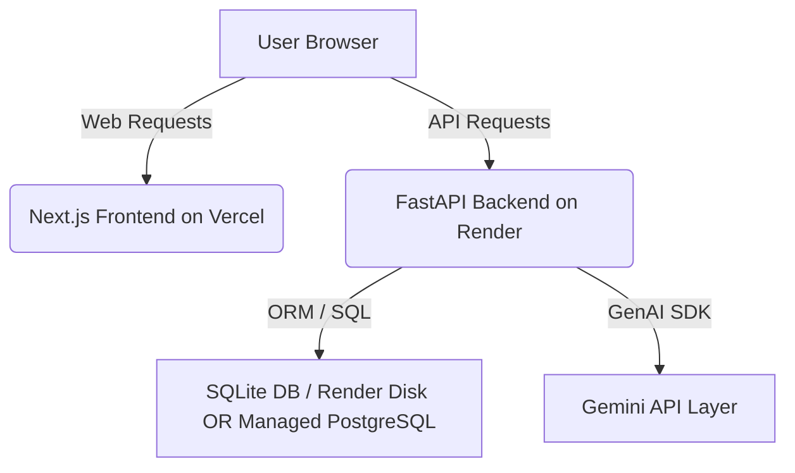

# SkyGuardian AI - Production Deployment Guide

This guide details how to deploy the **SkyGuardian AI** application publicly. The application is split into a **Next.js frontend** (optimized for Vercel) and a **FastAPI backend** (optimized for Render).

---

## 1. Architecture Overview

*   **Frontend**: Next.js 16 (App Router, Tailwind CSS, Space Grotesk/Share Tech Mono web fonts).
*   **Backend**: FastAPI, SQLAlchemy (v2.0 syntax), Uvicorn.
*   **Database**: SQLite (built-in, self-seeding) or PostgreSQL (configured via ORM connection string).
*   **Intelligence Layer**: Gemini Generative AI SDK (`gemini-1.5-flash` model).

---

## 2. Backend Deployment (Render)

Render is the recommended host for the FastAPI backend. It provides automatic TLS, native support for Python requirements, and optional persistent disks or managed databases.

### Deployment Steps:
1.  Sign in to [Render](https://render.com/).
2.  Click **New +** and select **Web Service**.
3.  Connect your GitHub/GitLab repository.
4.  Configure the service settings:
    *   **Name**: `skyguardian-backend` (or a custom name)
    *   **Environment**: `Python 3`
    *   **Region**: Select a region close to your target users (e.g., US Oregon)
    *   **Branch**: `main`
    *   **Build Command**: `pip install -r backend/requirements.txt`
    *   **Start Command**: `python -m uvicorn app.main:app --host 0.0.0.0 --port $PORT`
    *   **Cwd**: Set the root directory of the web service to `backend` (if Render supports root directories, otherwise set `backend` as the base directory or run commands prefixed with `python -m uvicorn app.main:app` from the repo root).
        *   *Recommended base directory setting in Render*: `backend`
        *   *If base directory is set to `backend`*:
            *   Build Command: `pip install -r requirements.txt`
            *   Start Command: `uvicorn app.main:app --host 0.0.0.0 --port $PORT`
5.  Open **Advanced** and add the required **Environment Variables** (see table below).
6.  Click **Create Web Service**.

### SQLite vs. PostgreSQL on Render
*   **SQLite (Default)**: The backend automatically creates `skyguardian.db` and runs the database seed process (`seed.py`) if the database is empty on startup. By default, Render Web Services have ephemeral filesystems. To prevent your database resetting on restarts, attach a **Persistent Disk** on Render (path: `/opt/skyguardian-data`) and set `DATABASE_URL=sqlite:////opt/skyguardian-data/skyguardian.db`.
*   **PostgreSQL (Recommended for Production)**: Create a **Render PostgreSQL database** (free tier available). Copy the database connection string and set `DATABASE_URL` in your backend service environment variables. Since `psycopg2-binary` is included in our `requirements.txt`, the application will connect, generate tables, and seed data automatically.

---

## 3. Frontend Deployment (Vercel)

Vercel is the native platform for Next.js, providing optimal edge caching and quick deployment.

### Deployment Steps:
1.  Sign in to [Vercel](https://vercel.com/).
2.  Click **Add New...** and select **Project**.
3.  Import your repository.
4.  Configure the project settings:
    *   **Framework Preset**: `Next.js`
    *   **Root Directory**: `frontend`
    *   **Build Command**: `npm run build`
    *   **Output Directory**: `.next`
5.  Under **Environment Variables**, configure the API base URL:
    *   **Key**: `NEXT_PUBLIC_API_URL`
    *   **Value**: The public URL of your Render backend API (e.g., `https://skyguardian-backend.onrender.com/api`).
        > [!IMPORTANT]
        > Do not append a trailing slash. It must end with `/api`.
6.  Click **Deploy**.

---

## 4. Environment Variables Reference

### Backend (Render Web Service)

| Variable Name | Required | Default Value | Description |
| :--- | :---: | :--- | :--- |
| `GEMINI_API_KEY` | **Yes** | `None` | Your Google Gemini API Key. Enables the RAG-based AI Assistant. If missing, high-fidelity demo mocks will be used. |
| `DATABASE_URL` | No | `sqlite:///./skyguardian.db` | SQL Connection String. Use Render Postgres string (`postgres://...`) for production. |
| `ALLOWED_ORIGINS` | No | `*` (development) | Comma-separated list of domains allowed to make CORS requests (e.g., `https://skyguardian-frontend.vercel.app`). |
| `PORT` | No | `8000` | Port for the Uvicorn application server (automatically managed by Render). |

### Frontend (Vercel Project)

| Variable Name | Required | Default Value | Description |
| :--- | :---: | :--- | :--- |
| `NEXT_PUBLIC_API_URL` | **Yes** | `http://localhost:8000/api` | The endpoint URL of your deployed backend service. The Next.js client-side code utilizes this to link API requests. |

---

## 5. Verifying Deployment Success

Once both frontend and backend services have successfully completed building, perform the following validation checks:

1.  **Datalink Verification**: Access `https://your-frontend.vercel.app/dashboard`. If the flight board loads flight numbers (`AI102`, `SG202`, etc.) and showing risk scores instead of a **DATALINK CONNECTION LOST** message, the frontend has successfully communicated with the backend.
2.  **AI Assistant Validation**: Type a question like *"Is Flight AI102 safe to operate?"* in the sidebar console. If the terminal prints a response stating `[SYS_RESPONSE_OK // GENAI_INTEL_FEED]` followed by flight parameters, the Gemini model and database RAG system are fully functional.
3.  **Anomaly Injection Test**: Click the **INJECT ANOMALY** button on the header of the dashboard. The page should refresh, updating telemetry streams, risk values (raising AI102 to critical status), and adding active alerts.
