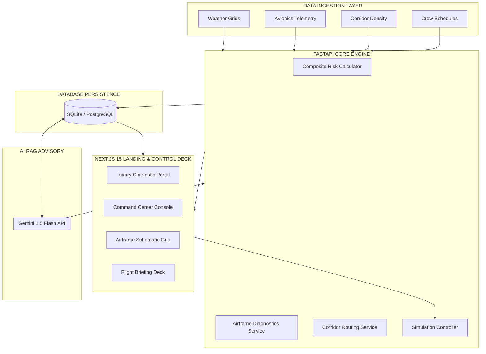

<p align="center">
  
</p>

# 🛡️ S K Y G U A R D I A N &nbsp; A I
### **Enterprise-Grade Aerospace Safety Assurance & Pre-Departure Risk Intelligence**

[](https://github.com)
[](https://github.com)
[](https://github.com)
[](https://github.com)

*A sovereign flight-readiness diagnostic platform uniting micro-scale meteorology, structural sensor telemetry, airspace corridor analytics, and RAG-driven executive intelligence.*

[**System Overview**](#-why-skyguardian-ai) • [**Core Architecture**](#-architecture) • [**Quick Start**](#-quick-start---installation) • [**Decision Logic**](#-ai-intelligence--decision-logic) • [**API Reference**](#-api-reference-console) • [**Roadmap**](#-development-roadmap--status)

</div>

<hr style="border: 0; height: 1px; background: linear-gradient(to right, rgba(229, 193, 88, 0), rgba(229, 193, 88, 0.45), rgba(229, 193, 88, 0)); margin: 40px 0;" />

<div align="center">
  <table width="85%" border="0" cellspacing="0" cellpadding="0">
    <tr>
      <td align="center" style="font-family: 'Cormorant Garamond', 'Times New Roman', serif; font-size: 1.3em; line-height: 1.8; color: #E0E0E0; font-style: italic; border-left: 2px solid #E5C158; border-right: 2px solid #E5C158; padding: 20px 35px; background: rgba(14, 16, 20, 0.4); border-radius: 4px;">
        "Commercial aviation operations demand instant, multi-dimensional decision verification. SkyGuardian AI collapses traditional operational silos—fusing airframe maintenance streams, meteorological telemetry, and human factor logs into an explainable safety rating. The result is a unified platform built for flight dispatchers, maintenance engineers, and executive safety directors who refuse to compromise."
      </td>
    </tr>
  </table>
</div>

<div align="center" style="margin-top: 40px; margin-bottom: 40px;">
  <h4>Active Command Center & Operations Dashboard</h4>
  <p align="center">
    
  </p>
  <p style="font-size: 0.85em; color: #888888; font-style: italic; margin-top: 12px;">Figure 1.0: Real-time airspace radar deck featuring route hazard contours, dynamic flight status indicators, and live airframe health summaries.</p>
</div>

<hr style="border: 0; height: 1px; background: linear-gradient(to right, rgba(229, 193, 88, 0), rgba(229, 193, 88, 0.45), rgba(229, 193, 88, 0)); margin: 40px 0;" />

## 🛡️ Why SkyGuardian AI?

In high-consequence operations, safety data is often fragmented. Maintenance personnel consult airframe sensor histories, dispatchers review meteorological weather maps, and schedulers track crew fatigue logs in distinct, unconnected software packages. 

SkyGuardian AI closes this gap by consolidating these disparate data sources. Using an advanced mathematical model, it constructs a real-time risk profile for every scheduled flight, generating a **Composite Risk Score** and translating telemetry signals into actionable recommendations.

### Legacy Operations vs. SkyGuardian AI Operations

| Metric / Dimension | Legacy Operations | SkyGuardian AI Operations |
| :--- | :--- | :--- |
| **Data Aggregation** | Manual correlation across 3+ software packages. | Real-time automated ingestion into a single pane of glass. |
| **Risk Assessment** | Static pre-departure checklists and subjective review. | Dynamic, data-driven Composite Risk Calculation. |
| **Airframe Status** | Text-based logs and delayed sensor feedback. | Interactive structural schematic showing active node alerts. |
| **Dispatch Advisory** | Disconnected weather briefs and pilot notes. | Generative Gemini 1.5 RAG-based executive briefing. |
| **Maintenance Action** | Reactive scheduling based on manual inspections. | Predictive anomaly forecasts using engine & hydraulic drifts. |

<hr style="border: 0; height: 1px; background: linear-gradient(to right, rgba(229, 193, 88, 0), rgba(229, 193, 88, 0.45), rgba(229, 193, 88, 0)); margin: 40px 0;" />

## ✨ Enterprise Feature Suite

SkyGuardian AI provides a comprehensive operational toolkit designed to satisfy the strict requirements of regulatory authorities, safety directors, and technical operations crews.

| Module | Technical Capabilities | Command & Control Impact |
| :--- | :--- | :--- |
| <div align="center">🚀<br><b>Radar Tracking</b></div> | Dynamic sweep radar tracking featuring active asset headings, airspace coordinates, and path vectors. | Real-time position tracking and spatial awareness of all aircraft within local corridors. |
| <div align="center">🩺<br><b>Airframe Health</b></div> | 3D jet structural silhouette showing pulsing diagnostic nodes (Nose, Engines, Fuselage, Tail). | Dynamic anomaly isolation, flashing warning nodes, and rapid maintenance scoping. |
| <div align="center">📊<br><b>Risk Indexing</b></div> | Mathematical calculation of pre-departure safety indices combining weather, airframe, traffic, and fatigue logs. | Standardization of release thresholds to eliminate subjective pre-departure calls. |
| <div align="center">⛈️<br><b>Corridor Hazards</b></div> | Bezier route tracking mapping enroute segments to active storm cells, wind shear, and icing altitudes. | Proactive rerouting around meteorological hazards prior to engine start. |
| <div align="center">🧠<br><b>Generative RAG</b></div> | Gemini 1.5 Flash reasoning engine processing flight data, METARs, and telemetry. | Instantly generates natural-language briefings and suggests corrective mitigation. |
| <div align="center">🧪<br><b>Fault Simulator</b></div> | Precision injection controls for EGT drift, hydraulic leaks, and battery decay. | Rigorous stress-testing of alarm thresholds and dispatcher response readiness. |
| <div align="center">📝<br><b>Executive Briefs</b></div> | Formatted, high-contrast, editorial-grade briefings with telemetry graphs and attributions. | Accelerates post-flight compliance, audits, and safety investigations. |

<hr style="border: 0; height: 1px; background: linear-gradient(to right, rgba(229, 193, 88, 0), rgba(229, 193, 88, 0.45), rgba(229, 193, 88, 0)); margin: 40px 0;" />

## 🖥️ Operational Control Room Showcase

Each interface within SkyGuardian AI is crafted following a custom **Luxury Aerospace Design System**, merging editorial typography (`Cormorant Garamond`, `Libre Baskerville`) with operational monospaced diagnostics (`IBM Plex Mono`) and generous whitespace.

<table border="0" cellspacing="15" cellpadding="0" style="border-collapse: collapse; border: none; width: 100%;">
  <tr style="border: none;">
    <td width="50%" align="center" style="border: none; padding: 10px;">
      <div style="background-color: #0E1014; border: 1px solid rgba(229, 193, 88, 0.1); border-radius: 6px; padding: 15px; box-shadow: 0 4px 12px rgba(0,0,0,0.5);">
        <b style="font-family: 'Cormorant Garamond', serif; font-size: 1.1em; color: #E5C158;">1. Flight Safety Briefing & Audit Deck</b>
        <br/><br/>
         
        <p style="font-size: 0.8em; color: #999; text-align: left; margin-top: 10px;">Detailed safety logs, segment-by-segment hazard attributions, and composite telemetry trends formatted as an executive document.</p>
      </div>
    </td>
    <td width="50%" align="center" style="border: none; padding: 10px;">
      <div style="background-color: #0E1014; border: 1px solid rgba(229, 193, 88, 0.1); border-radius: 6px; padding: 15px; box-shadow: 0 4px 12px rgba(0,0,0,0.5);">
        <b style="font-family: 'Cormorant Garamond', serif; font-size: 1.1em; color: #E5C158;">2. Fleet Airframe Diagnostics Matrix</b>
        <br/><br/>
        
        <p style="font-size: 0.8em; color: #999; text-align: left; margin-top: 10px;">Interactive aircraft schematic displaying critical node statuses, engine variables, and active maintenance predictions.</p>
      </div>
    </td>
  </tr>
  <tr style="border: none;">
    <td width="50%" align="center" style="border: none; padding: 10px;">
      <div style="background-color: #0E1014; border: 1px solid rgba(229, 193, 88, 0.1); border-radius: 6px; padding: 15px; box-shadow: 0 4px 12px rgba(0,0,0,0.5);">
        <b style="font-family: 'Cormorant Garamond', serif; font-size: 1.1em; color: #E5C158;">3. Intelligent RAG Advisor Panel</b>
        <br/><br/>
        
        <p style="font-size: 0.8em; color: #999; text-align: left; margin-top: 10px;">Natural language assistant with access to weather databases, pilot manuals, and fleet telemetry for automated mitigation advisories.</p>
      </div>
    </td>
    <td width="50%" align="center" style="border: none; padding: 10px;">
      <div style="background-color: #0E1014; border: 1px solid rgba(229, 193, 88, 0.1); border-radius: 6px; padding: 15px; box-shadow: 0 4px 12px rgba(0,0,0,0.5);">
        <b style="font-family: 'Cormorant Garamond', serif; font-size: 1.1em; color: #E5C158;">4. Aircraft Health Structural Schematic</b>
        <br/><br/>
        
        <p style="font-size: 0.8em; color: #999; text-align: left; margin-top: 10px;">High-resolution diagnostic outline representing engine, nozzle, fuselage, nose cone, and rudder telemetry health scores.</p>
      </div>
    </td>
  </tr>
</table>

<hr style="border: 0; height: 1px; background: linear-gradient(to right, rgba(229, 193, 88, 0), rgba(229, 193, 88, 0.45), rgba(229, 193, 88, 0)); margin: 40px 0;" />

## 🏗️ Architecture & Dataflow

SkyGuardian AI is engineered as a decoupled, multi-tier system built for high-performance data processing and AI inference.



<br/>

## 📂 Project Repository Architecture

For developers and engineering leads, here is the directory layout of SkyGuardian AI. The repository is structured to separate concerns between high-performance async API processing and modern rendering interfaces.

<details>
<summary><b>📐 Click to Expand Repository Directory Tree</b></summary>

```
skyguardian-ai/
├── frontend/                    # Next.js 15 App Router
│   ├── src/
│   │   ├── app/
│   │   │   ├── page.tsx         # Brand Entry Portal
│   │   │   └── dashboard/       # Operations Control Panel
│   │   │       ├── layout.tsx   # Header Console & AI Sidebar Frame
│   │   │       ├── page.tsx     # Airspace Radar Deck & Flight Cards
│   │   │       ├── fleet/       # Airframe Health Schematic & Telemetry
│   │   │       └── flight/      # Flight Briefing & Segment Hazards
│   │   ├── components/
│   │   │   └── ChatPanel.tsx    # RAG Intel Console (AI Assistant)
│   │   ├── lib/
│   │   │   └── api.ts           # REST API client configurations
│   │   └── styles/
│   │       └── globals.css      # Core Design System (editorial fonts & overlays)
│   └── public/                  # Static assets & luxury hero photos
│
├── backend/                     # FastAPI Application
│   ├── app/
│   │   ├── api/
│   │   │   └── endpoints.py     # FastAPI endpoints (Flights, Telemetry, RAG, Sim)
│   │   ├── db/
│   │   │   ├── models.py        # SQLAlchemy models (Aircraft, Flight, RiskScore, Alert, TelemetrySnapshot)
│   │   │   ├── seed.py          # Operational seed databases (Active flights, tail numbers)
│   │   │   └── session.py       # Session managers
│   │   ├── services/
│   │   │   ├── assistant.py     # Gemini RAG integration
│   │   │   ├── health.py        # Airframe health analytics & failure forecast
│   │   │   ├── risk.py          # Pre-departure risk engine
│   │   │   └── weather.py       # Route segments & METAR weather services
│   │   └── main.py              # Application entry point
│   └── requirements.txt         # Python dependencies list
```
</details>

<hr style="border: 0; height: 1px; background: linear-gradient(to right, rgba(229, 193, 88, 0), rgba(229, 193, 88, 0.45), rgba(229, 193, 88, 0)); margin: 40px 0;" />

## 🧠 AI Intelligence & Decision Logic

SkyGuardian AI operates on deterministic calculations combined with generative semantic reasoning to deliver robust safety decisions.

### 1. Pre-Departure Risk Formula
The system evaluates a flight’s clearance readiness by calculating a **Composite Risk Score (out of 100)**:

$$\text{Composite Risk} = W \times 0.40 + H \times 0.30 + T \times 0.15 + P \times 0.15$$

Where:
*   **$W$ (Weather Score)**: Assessed enroute segment meteorological parameters (turbulence, storm cell contours, visibility index).
*   **$H$ (Airframe Health Score)**: Real-time telemetry monitoring (sensor drifts, thermal indices, structural strain).
*   **$T$ (Airspace Traffic Density)**: Corridor slot occupancy vector mapping active assets in flight corridors.
*   **$P$ (Human Factors Score)**: Crew duty fatigue levels, scheduling history, and rest hours.

---

### 2. Airframe Health Rating
The mechanical readiness index is calculated from component telemetry drifts:

$$\text{Health Score} = E \times 0.35 + Y \times 0.35 + O \times 0.15 + B \times 0.15$$

Where:
*   **$E$**: Engine Exhaust Gas Temperature (EGT) anomaly score.
*   **$Y$**: Hydraulic Pressure drift anomaly score.
*   **$O$**: Oil Pressure status anomaly score.
*   **$B$**: Auxiliary battery charge health rating.

---

### 3. Gemini 1.5 Flash RAG Advisor
The generative safety advisory engine connects deep telemetry histories with semantic guidelines:
*   **Ingestion Pipeline**: Fetches live database variables, current meteorological briefs, and maintenance histories.
*   **Reasoning Framework**: Processes telemetry trends, correlates failures with airframe specifications, and provides natural-language risk summaries.
*   **Contextual Output**: Drafts executive-style compliance briefings, and offers structured suggestions for dispatch teams.

<hr style="border: 0; height: 1px; background: linear-gradient(to right, rgba(229, 193, 88, 0), rgba(229, 193, 88, 0.45), rgba(229, 193, 88, 0)); margin: 40px 0;" />

## 🚀 Quick Start & Installation

To run a local copy of SkyGuardian AI for engineering audits, follow these steps.

### Prerequisites
*   **Node.js** v18.0+ & npm
*   **Python** 3.11+
*   **Git**

---

### Installation Flow

1. **Clone the Repository**
   ```bash
   git clone https://github.com/YOUR_USERNAME/skyguardian-ai.git
   cd skyguardian-ai
   ```

2. **Configure & Start Backend Engine**
   ```bash
   cd backend
   python -m venv venv
   source venv/bin/activate  # On Windows: venv\Scripts\activate
   pip install -r requirements.txt
   ```
   Create a `.env` file in the `backend/` directory:
   ```env
   GEMINI_API_KEY=your_gemini_api_key_here
   DATABASE_URL=sqlite:///./skyguardian.db
   ```
   Initialize the database seed and launch the uvicorn development server:
   ```bash
   uvicorn app.main:app --reload --port 8000
   ```
   > [!NOTE]
   > The interactive API documentation will be available at [http://localhost:8000/docs](http://localhost:8000/docs).

3. **Configure & Start Luxury UI**
   Open a new terminal session:
   ```bash
   cd frontend
   npm install
   npm run dev
   ```
   > [!TIP]
   > Access the luxury flight operations command deck at [http://localhost:3000](http://localhost:3000).

<hr style="border: 0; height: 1px; background: linear-gradient(to right, rgba(229, 193, 88, 0), rgba(229, 193, 88, 0.45), rgba(229, 193, 88, 0)); margin: 40px 0;" />

## 📡 API Reference Console

All data services are exposed via a high-performance REST API. Here is a summary of the available endpoints.

| Method | Endpoint | Payload / Params | Response Summary | Purpose |
| :---: | :--- | :--- | :--- | :--- |
| `GET` | `/api/flights` | *None* | `Array[Flight]` | Lists active and scheduled flights with tail numbers, risk scores, and status flags. |
| `GET` | `/api/flights/{id}` | `id` (path) | `FlightDetail` | Returns detailed pre-departure risk profiles, meteorological corridor waypoints, and telemetry charts. |
| `GET` | `/api/alerts` | *None* | `Array[Alert]` | Lists active system alerts (e.g., Engine drift, weather anomalies). |
| `GET` | `/api/aircraft/health` | *None* | `FleetHealth` | Aggregates the overall status of the fleet, including predicted failures and node values. |
| `POST` | `/api/assistant/query` | `{"query": "string"}` | `{"response": "string"}` | Submits a natural-language query to the Gemini 1.5 Flash RAG Engine. |
| `POST` | `/api/simulator/tick` | *None* | `{"status": "updated"}` | Triggers a simulation tick, injecting mechanical degradation anomalies (EGT drift, hydraulic leaks). |

<br/>

<details>
<summary><b>📂 View Database Schema (SQL DDL Models)</b></summary>

```sql
-- Aircraft Table Model
CREATE TABLE aircraft (
    aircraft_id VARCHAR PRIMARY KEY,
    operator_id VARCHAR NOT NULL REFERENCES operators(operator_id),
    tail_number VARCHAR UNIQUE NOT NULL,
    aircraft_type VARCHAR NOT NULL,
    current_health_status VARCHAR DEFAULT 'Healthy',
    created_at TIMESTAMP DEFAULT CURRENT_TIMESTAMP
);

-- Flights Table Model
CREATE TABLE flights (
    flight_id VARCHAR PRIMARY KEY,
    operator_id VARCHAR NOT NULL REFERENCES operators(operator_id),
    aircraft_id VARCHAR NOT NULL REFERENCES aircraft(aircraft_id),
    flight_number VARCHAR NOT NULL,
    origin_airport VARCHAR NOT NULL,
    destination_airport VARCHAR NOT NULL,
    scheduled_departure TIMESTAMP NOT NULL,
    scheduled_arrival TIMESTAMP NOT NULL,
    status VARCHAR DEFAULT 'Scheduled'
);

-- Telemetry Snapshot Table Model
CREATE TABLE telemetry_snapshots (
    snapshot_id VARCHAR PRIMARY KEY,
    aircraft_id VARCHAR NOT NULL REFERENCES aircraft(aircraft_id),
    timestamp TIMESTAMP DEFAULT CURRENT_TIMESTAMP,
    egt_temp FLOAT,
    oil_pressure FLOAT,
    hydraulic_pressure FLOAT,
    battery_charge FLOAT
);
```
</details>

<hr style="border: 0; height: 1px; background: linear-gradient(to right, rgba(229, 193, 88, 0), rgba(229, 193, 88, 0.45), rgba(229, 193, 88, 0)); margin: 40px 0;" />

## 👥 User Roles & Access Matrix

SkyGuardian AI provides tailored views and permission structures for different members of the flight operations team.

| Role | Interface Focus | Core Responsibility | Key Decision Point |
| :--- | :--- | :--- | :--- |
| **Flight Dispatch Director** | Command Center Radar | Pre-departure risk analysis & release sign-off. | Overrides/grants flight dispatch approval. |
| **Maintenance Engineer** | Airframe Diagnostics Schematic | Structural sensor health analysis & telemetry tracing. | Schedules hangar work & component swap-outs. |
| **Safety Inspector** | Executive Briefing & Audit Panel | Reviewing explainable AI reports and regulatory compliance. | Flags systemic hazards across specific fleet lines. |
| **Operations Manager** | Fleet Metrics Deck | Managing scheduling constraints & slot capacities. | Reschedules flights due to severe weather delays. |

<hr style="border: 0; height: 1px; background: linear-gradient(to right, rgba(229, 193, 88, 0), rgba(229, 193, 88, 0.45), rgba(229, 193, 88, 0)); margin: 40px 0;" />

## 🛠️ Technology Stack

Designed for sovereign, high-uptime deployments, SkyGuardian AI uses modern, industry-standard frameworks:

*   **Frontend Client Deck**
    *   **Framework**: Next.js 15 (App Router, Turbopack)
    *   **Styling**: Tailwind CSS (Custom glassmorphic utility system)
    *   **Visualizations**: Recharts (telemetry trends), Framer Motion (conic radar animations)
    *   **Icons**: Lucide Icons
*   **Backend Core Engine**
    *   **Framework**: FastAPI (Asynchronous Python ASGI)
    *   **ORM / Data Model**: SQLAlchemy 2.0
    *   **Data Validation**: Pydantic v2
    *   **AI Integration**: Google Generative AI Python SDK (Gemini API)
*   **Data & Persistence**
    *   **Development**: SQLite (Zero-configuration relational storage)
    *   **Production**: PostgreSQL (Enterprise-ready multi-tenant scaling)

<hr style="border: 0; height: 1px; background: linear-gradient(to right, rgba(229, 193, 88, 0), rgba(229, 193, 88, 0.45), rgba(229, 193, 88, 0)); margin: 40px 0;" />

## 🚀 Enterprise Deployment Status

SkyGuardian AI is configured for direct deployment using serverless hosting or sovereign private cloud instances.

| Component | Platform | Deployment Status | Required Environment Variables |
| :--- | :--- | :--- | :--- |
| **Frontend UI** | Vercel | [](https://vercel.com) | `NEXT_PUBLIC_API_URL` (Pointer to Backend API URL) |
| **Backend API** | Render / Private Cloud | [](https://render.com) | `GEMINI_API_KEY`, `DATABASE_URL` |

<hr style="border: 0; height: 1px; background: linear-gradient(to right, rgba(229, 193, 88, 0), rgba(229, 193, 88, 0.45), rgba(229, 193, 88, 0)); margin: 40px 0;" />

## 📅 Development Roadmap & Status

| Phase | Target Date | Description | Status |
| :---: | :---: | :--- | :---: |
| **Phase 1** | *Q1 2026* | Pre-Departure Risk Index Calculation Engine (MVP). | `COMPLETED` |
| **Phase 2** | *Q2 2026* | Airframe Health Schematic & Pulsing Diagnostics. | `COMPLETED` |
| **Phase 3** | *Q3 2026* | Real-Time ADS-B Transponder Integration for active flights. | `PLANNED` |
| **Phase 4** | *Q4 2026* | Predictive Meteorological Icing Grid & Weather Models. | `PLANNED` |
| **Phase 5** | *Q2 2027* | Multi-Fleet SatCom Data Synchronization & Private Cloud Clustering. | `VISION` |

<hr style="border: 0; height: 1px; background: linear-gradient(to right, rgba(229, 193, 88, 0), rgba(229, 193, 88, 0.45), rgba(229, 193, 88, 0)); margin: 40px 0;" />

## 🔮 Future Vision

As aviation transitions towards autonomous urban air mobility (UAM), electric vertical takeoff and landing (eVTOL) passenger grids, and commercial space flight, pre-departure safety decision cycles must shrink from hours to milliseconds. 

SkyGuardian AI aims to establish the definitive security and risk assurance layer for these next-generation networks, processing telemetry anomalies at scale and validating flight release criteria automatically prior to takeoff.

<hr style="border: 0; height: 1px; background: linear-gradient(to right, rgba(229, 193, 88, 0), rgba(229, 193, 88, 0.45), rgba(229, 193, 88, 0)); margin: 40px 0;" />

## 🤝 Contributing

We welcome contributions from safety software engineers, aerospace developers, and data scientists.

1.  **Fork** the repository on GitHub.
2.  **Create a Feature Branch**: `git checkout -b feature/advanced-telemetry-model`.
3.  **Commit Your Changes**: `git commit -m 'feat: implement advanced engine telemetry anomaly filter'`.
4.  **Push Branch**: `git push origin feature/advanced-telemetry-model`.
5.  **Submit a Pull Request** explaining your diagnostic changes and safety implications.

<hr style="border: 0; height: 1px; background: linear-gradient(to right, rgba(229, 193, 88, 0), rgba(229, 193, 88, 0.45), rgba(229, 193, 88, 0)); margin: 40px 0;" />

## 📄 License

This project is licensed under the MIT License — see the [LICENSE](LICENSE) file for details.

<hr style="border: 0; height: 1px; background: linear-gradient(to right, rgba(229, 193, 88, 0), rgba(229, 193, 88, 0.45), rgba(229, 193, 88, 0)); margin: 40px 0;" />

## 🙏 Acknowledgements & References

*   **Google Gemini Team** for providing the API and tools supporting the RAG advisory services.
*   **FastAPI Devs** for high-performance python framework design.
*   **Recharts Team** for robust graphing components.
*   **Aviation Safety Reporting System (ASRS)** data guidelines used to frame composite threat factors.

<hr style="border: 0; height: 1px; background: linear-gradient(to right, rgba(229, 193, 88, 0), rgba(229, 193, 88, 0.45), rgba(229, 193, 88, 0)); margin: 40px 0;" />

<div align="center">

Built with 🛡️ for next-generation flight operations.

**SkyGuardian AI** — *Assuring the future of aerospace pre-departure intelligence.*

</div>
